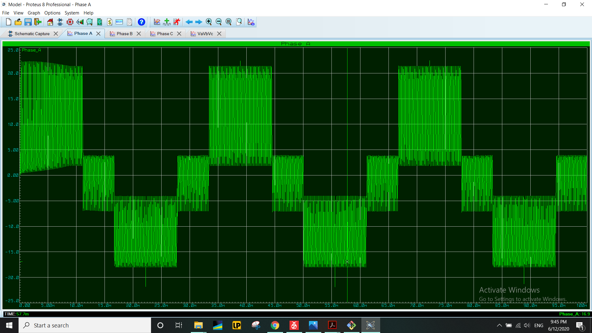
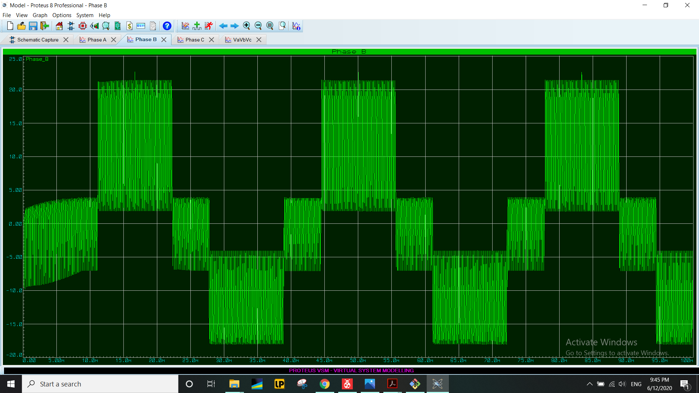
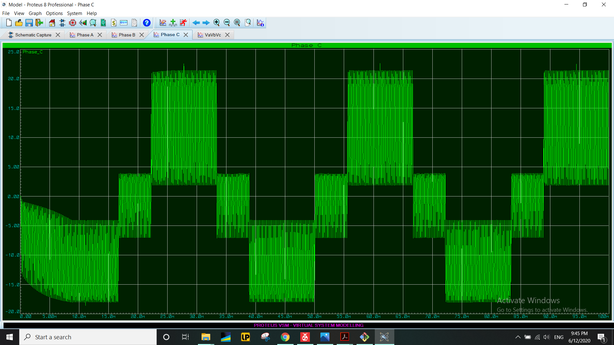
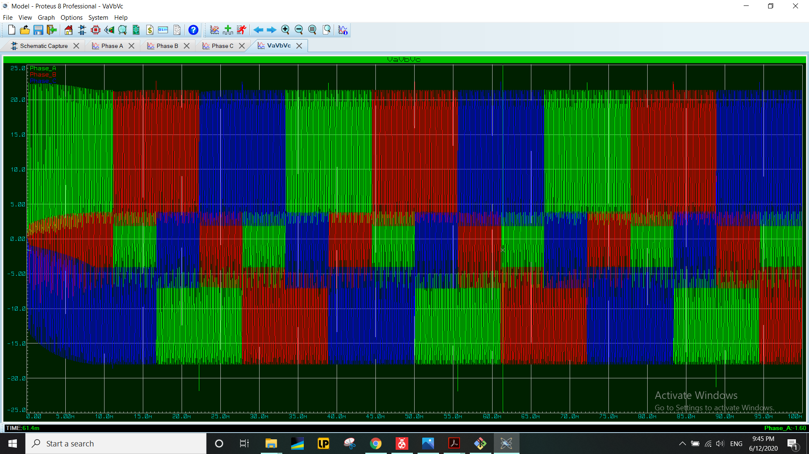
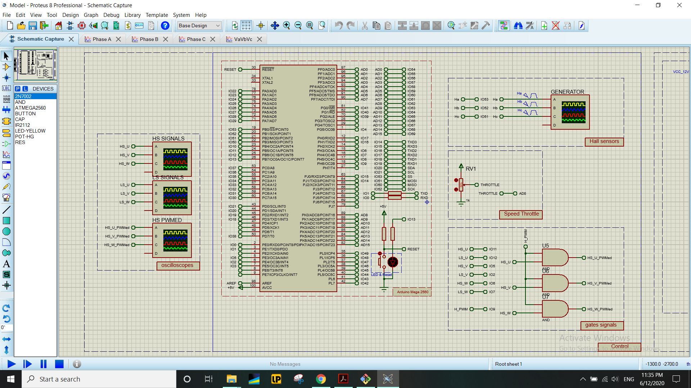
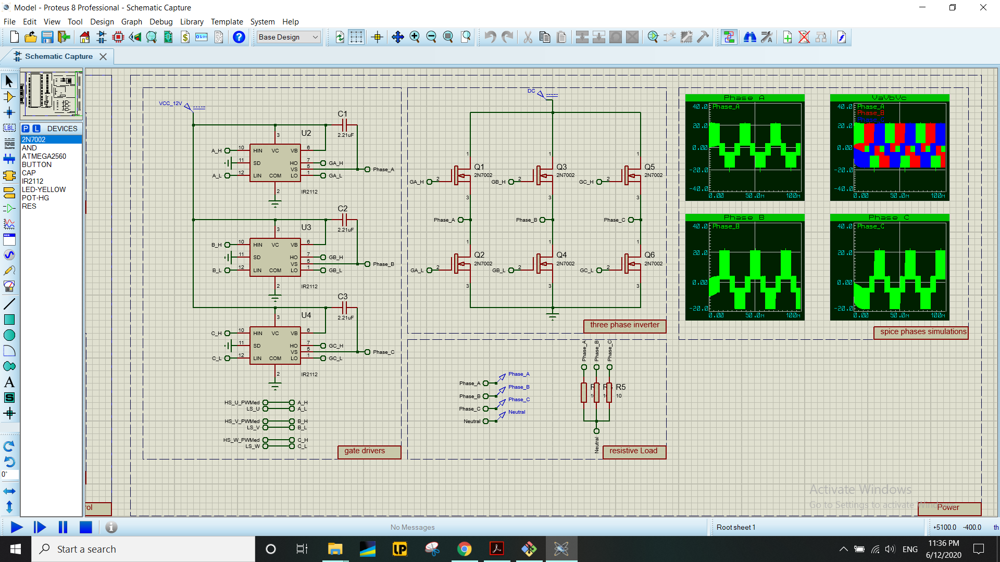

# BLDC-Openloop-ATmega2560
Control your BLDC motor using Arduino Mega/ATmega2560.

# The repository contains:
* Atmel Studio project for the BLDC open-loop controller.
* A very clear Proteus model for verification of the controller and the power circuit using PROSPICE feature of proteus.
* A code for hall sensors generation using Arduino UNO and SimulIDE for hardware verification.

# Gallery

## phase U

## phase V

## phase W

## phase UVW

## control circuit

## power circuit

